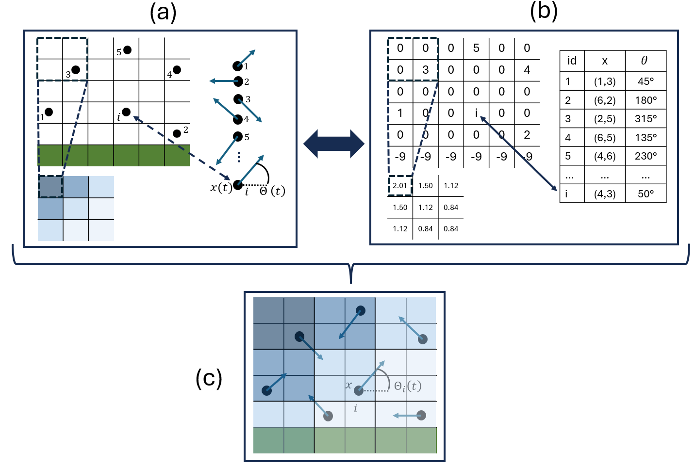
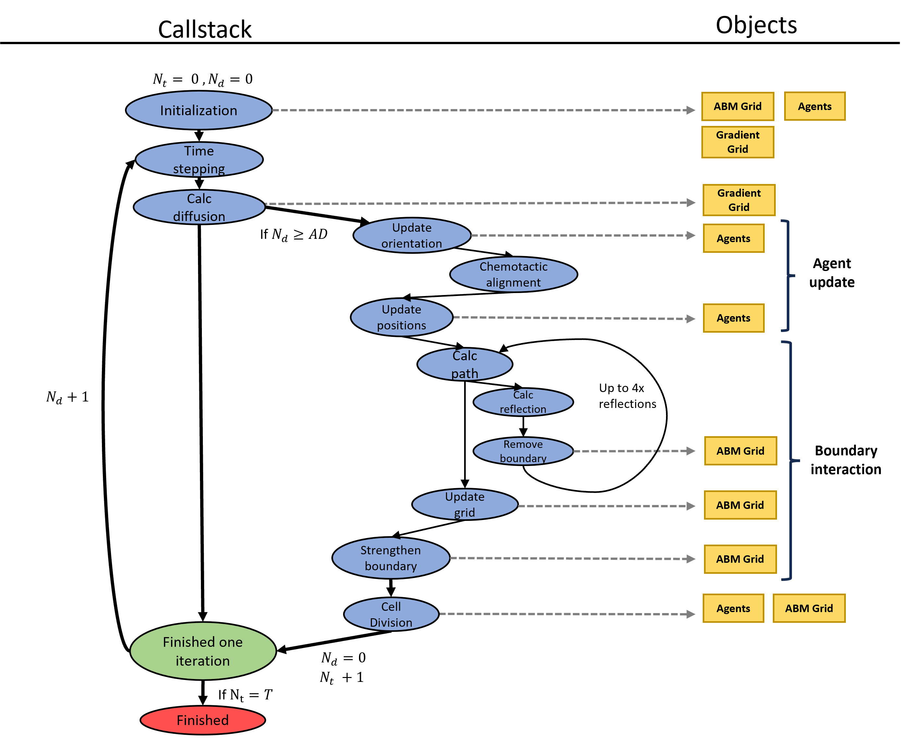
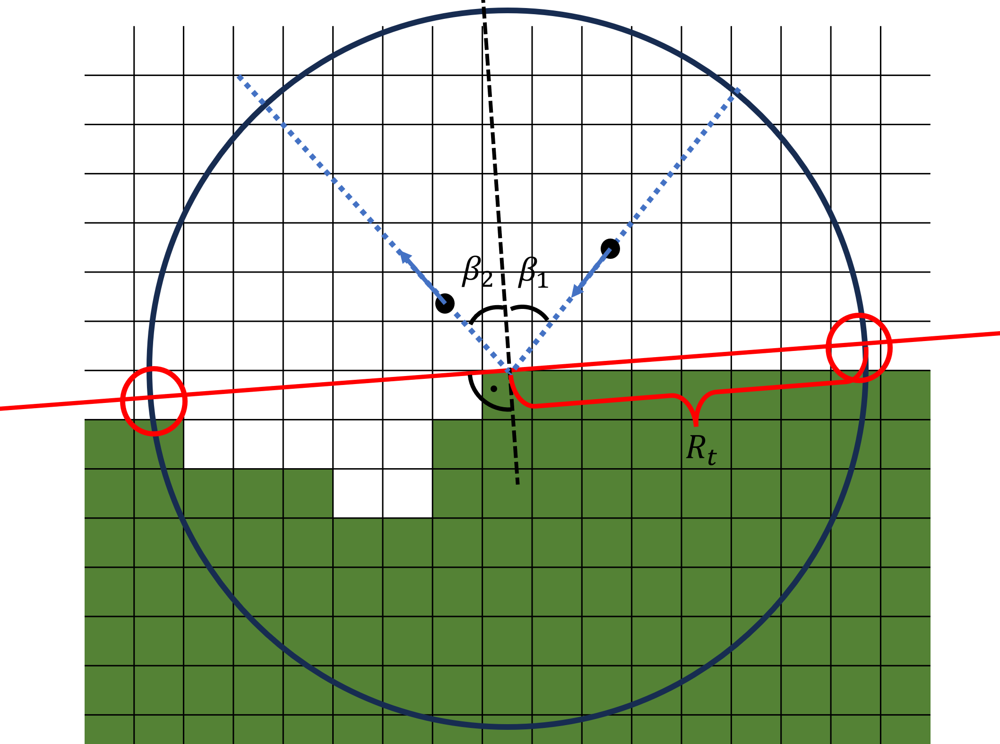
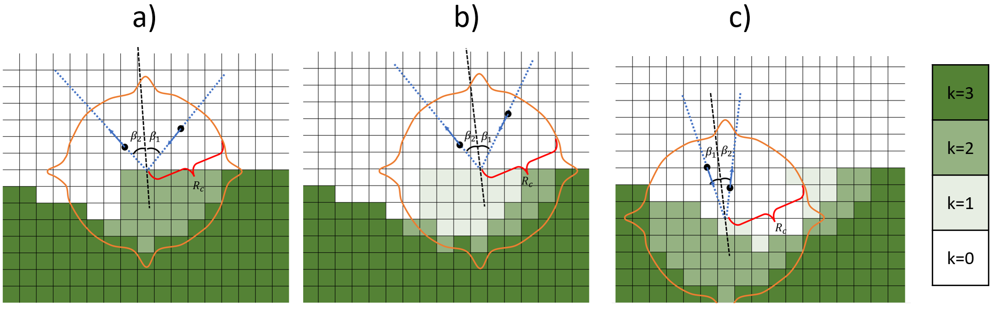
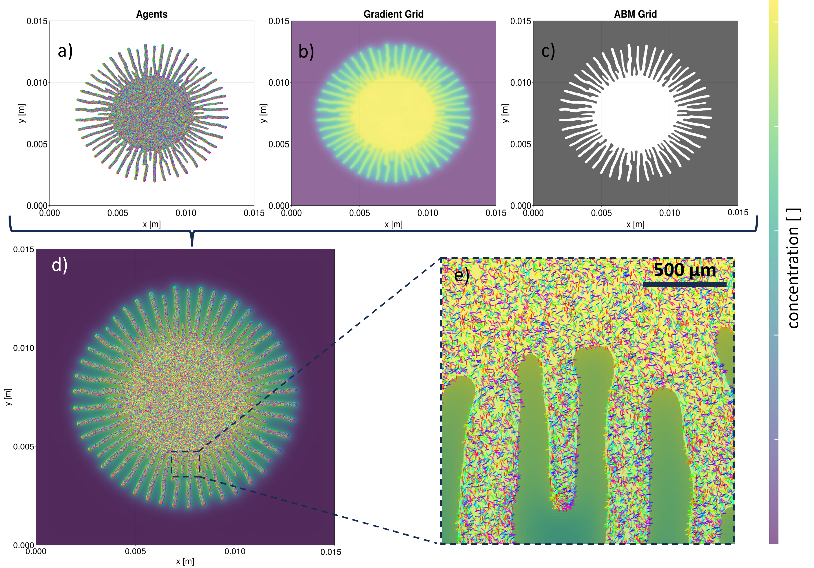

# Structure 
Adapted from the publication. Kuhn. et al. "An agent-based model of Trypanosoma brucei social motility
to explore determinants of colony pattern formation" Plos Compuation Biology 2026.  Look it up form more details. 

## Model Architecture

To model trypanosome social motility, we combined an agent-based model for the individual cells with a continuous model for chemical signalling and diffusion. The state of the model is stored in three primary data structures (Figure 1). First, a table of agents representing the trypanosomes contains for each entry a unique identifier (id), the position **x**(t), and the orientation θ(t) as the angle in the 2D plane relative to the horizontal axis (Figure 1a). Second, a 2D integer array called the agent-based model grid (ABM grid) models the spatial environment. Third, a 2D floating-point array called the gradient grid stores the chemical concentration values s(x).

The ABM grid is a square lattice for which the lattice constant Δx was set to 3.75 μm, corresponding to a unit cell area of 14.06 μm². Each grid cell stores an integer value k, where:

- k > 0 indicates the unique ID of an agent occupying that cell (only one agent per grid cell is possible),
- k = 0 represents an empty, walkable grid cell,
- k < 0 denotes a non-walkable grid cell outside the colony, with the absolute value of k determining the grid strength.

The gradient grid stores the local chemical concentration at each grid point and handles calculations for chemical diffusion, adsorption, and decay. To reduce computational cost, this grid can operate at a coarser resolution than the ABM grid, controlled by an integer scaling factor s_f (e.g., 1, 2, 3, 4, ...). For s_f = 1, both grids share the same resolution; for s_f > 1, the gradient grid is coarser. Consequently, each gradient grid cell corresponds to s_f² (1, 4, 9, 16, ...) ABM grid cells.

---

**Figure 1. Schematic of the model architecture.**
(a) Conceptual representation of individual components: ABM grid (left), agent table/list (right), and gradient grid (s_f = 2) (below). Each agent (black dot) occupies one cell in the ABM grid; walkable cells are white, and non-walkable cells are green. The agent table stores the position **x**(t) and direction θ(t) (blue arrow) of all agents. With scaling factor s_f = 2, four ABM grid cells map to one gradient grid cell, with chemical concentration indicated by blue colour intensity.
(b) Computational implementation of the data structures from (a): The ABM grid is a 6×6 2D integer array, where negative values indicate the grid strength k, zero indicates a free grid cell, and positive values indicate the agent ID of the occupying agent. The agent table is a vector containing position (integer tuple) and orientation (floating-point value between 0 and 2π), and the gradient grid is a smaller 3×3 2D floating-point array.
(c) Conceptual representation of the integrated model: agents move in their current direction through varying chemical concentrations on empty ABM grid cells.

---

## Initialisation

The model initialisation proceeds in several sequential steps:

1. Creation of the ABM grid with desired size L and corresponding number of grid points.
2. Assignment of the same negative value k₀ (grid strength) to all grid points.
3. Definition of the initial colony geometry by setting all grid points to zero within a circle with radius r_colony from the centre of the ABM grid.
4. Random placement of N agents on walkable grid points (k = 0) with random orientations drawn from a uniform distribution.
5. Creation of the gradient grid, scaled to the ABM grid with factor s_f and initialised with a small, randomly distributed chemical concentration drawn from a uniform distribution on the interval [10⁻⁶, 10⁻⁵]. This was chosen instead of an initialisation with zero to avoid numerical errors that can occur due to limited floating point precision and subsequent solving of the discretised diffusion equation at each grid point.

## Simulations

The simulations are performed in an iterative manner. Updates of the gradient grid, the agents, and the ABM grid are combined (Figure 2). In the following, we describe the individual parts in detail.

---

**Figure 2. Flowchart of the internal model logic.**
The blue ovals represent functions that are called in consecutive order, and the yellow boxes represent the objects that they modify. The green oval represents the end of one iteration and the red oval represents the end of one model run. The model has two internal counters: N_t, which counts the number of agent time steps Δt_a, and N_d, which counts the number of diffusion time steps Δt_d per Δt_a to be exactly AD.

---

### Time Stepping

The model updates its components using two different time steps. The first, Δt_d, governs the time evolution of the gradient grid. The second time step, Δt_a, governs updates to agent positions, orientations, and boundary strengths in the ABM grid. This separation of time scales allows for efficient simulation whilst maintaining the accuracy of both the chemical diffusion dynamics and agent movement. The ratio of the two time steps Δt_d / Δt_a is set as AD. Hence, during one iteration, we perform AD diffusion steps and one step of updating the agents and the ABM grid (Figure 2).

### Calculate Diffusion

The model computes the evolution of the chemical field s(x,t) on the gradient grid in space (x) and time (t) with a two-dimensional reaction-diffusion equation with diffusion constant D_s, decay rate d_r, and adsorption a_d caused by the N agents at their ABM grid cells x_n. As s_f² ABM grid cells are mapped to one gradient grid cell, the adsorption is normalised by that factor:

$$\frac{\partial s(x,t)}{\partial t} = D_s \nabla^2 s(x,t) - d_r s(x,t) + \frac{a_d}{s_f^2} \sum_{n=1}^{N} \delta(x - x_n)$$

This equation is discretised and numerically solved using the finite difference method FTCS (forward time-centred space) with Dirichlet boundary conditions, where the value of s on the boundary is fixed to its initialisation value. This method is commonly used for solving parabolic differential equations and was specifically chosen because its time-explicit nature allows easier integration with the agent dynamics compared to implicit methods. The implementation uses the Julia packages `ParallelStencils` and `ImplicitGlobalGrid`. The discretised equation

$$s^{t+\Delta t_d}_{i,j} = s^t_{i,j} + D_s \Delta t_d \left( \frac{s^t_{i,j+1} - 2s^t_{i,j} + s^t_{i,j-1}}{\Delta x^2} + \frac{s^t_{i+1,j} - 2s^t_{i,j} + s^t_{i-1,j}}{\Delta y^2} \right) - d_r \Delta t_d \, s^t_{i,j} + \frac{a_d}{s_f^2} \Delta t_d \sum_{n=1}^{N} \delta(x_{i,j} - x_n)$$

calculates the concentration s at each grid cell with indices (i,j) at time t + Δt_d, which changes from the value of s(t)_(i,j) through diffusion from or to neighbouring grid cells, the decay of the chemical with rate d_r, and the adsorption of the chemical with rate a_d. The Dirac delta function δ(·) is only non-zero when x_n is one of the s_f² ABM grid cells mapping to the gradient grid cell with position x_(i,j) (Figure 1).

The maximum time step size Δt_d to ensure numerical stability can be derived using von Neumann stability analysis (see [Von Neumann Stability Analysis](#von-neumann-stability-analysis) for more details):

$$\Delta t_d \leq \frac{\Delta x^2}{4 D_s + \dfrac{d_r \Delta x^2}{2}}$$

### Agent Update

In every time step Δt_a, each agent updates its orientation and position. First, the orientation is updated:

$$\theta_i(t + \Delta t_a) = \theta_i(t) + \alpha \frac{\angle\!\left(\begin{bmatrix}\cos\theta_i(t)\\ \sin\theta_i(t)\end{bmatrix},\, -\nabla s(x_i)\right)}{N_o(\nabla s,\, x_i)} \Delta t_a + \eta_i(t)\,\Delta t_a$$

where the angle between two vectors is calculated as

$$\angle(\vec{g}, \vec{u}) = \text{atan2}(\vec{g} \times \vec{u},\; \vec{g} \cdot \vec{u})$$

with the normalisation function

$$N_o(\nabla s, x) = \frac{|\nabla s(x)|}{\max(|\nabla s|)}$$

The agents try to turn their current direction towards the negative gradient of the chemical field s(x_i) at their position x_i. The speed of this negative chemotactic alignment process is determined by the maximum gradient in the system through the normalisation factor N_o and a tunable turning rate parameter α, creating a relative response: for α = 1, an agent at the location of the steepest gradient in the system will completely align its direction in one time step, whilst agents in regions with weaker gradients will align proportionally slower. When α < 1, the alignment speed is linearly scaled down by this factor. The term η_i(t) models the stochastic component of the agent's movement and alignment process and is drawn from a normal distribution with mean 0° and standard deviation η.

Each agent's position is updated with

$$\mathbf{x}_i(t + \Delta t_a) = \mathbf{x}_i(t) + v_i \Delta t_a \begin{bmatrix}\cos\theta_i(t+\Delta t_a)\\ \sin\theta_i(t+\Delta t_a)\end{bmatrix}$$

The agents move from their current position **x**_i(t) in the direction θ_i(t + Δt_a) with velocity v_i, which is drawn from a normal distribution with mean v₀ and standard deviation v_σ. Since **x**(t + Δt_a) is a vector of two continuous values, it is rounded to the nearest discrete grid cell on the ABM grid, whereas θ_i(t + Δt_a) is not rounded and is stored in the agent table. Such an update scheme is labelled as microscopic dry active matter, or in other terminology, modified active Brownian particles with auto-chemotactic alignment.

Agent update depends on the time step Δt_a. Its value must strike a balance between two opposing constraints. If Δt_a is too small, the time discretisation becomes overly fine, potentially introducing discretisation artefacts: agents may move only one grid cell, or remain stationary, per step, which distorts movement dynamics. Conversely, if Δt_a is too large, agents may traverse unrealistically long distances in a single step. This results in other discretisation artefacts, such as unnaturally straight trajectories, which contradict experimental observations of cell motility. In addition, rapid changes in the local environment, such as the number and identity of neighbouring agents or proximity to boundaries, impair biologically plausible agent–agent interactions.

To balance these constraints, Δt_a was chosen to allow agents to move on average three ABM grid cells per time step in their current direction. This corresponds to a distance of 11.25 μm, which is shorter than the typical cell length of a procyclic trypanosome (~15–25 μm), thereby preserving local agent–agent interactions.

For typical model parameters, the ratio AD = Δt_a / Δt_d ranges between 1 and 300. If necessary, the diffusion time step Δt_d is slightly reduced from its maximum allowable value to ensure that AD is always an integer. This guarantees a consistent number of diffusion time steps Δt_d per agent time step Δt_a throughout the simulation.

### Boundary Interactions

The model simulates agent interactions with the colony boundary through reflective boundary conditions, whereby agents are reflected upon encountering a non-walkable grid cell on their path. Whilst real trypanosomes do not undergo physical reflection from colony boundaries, they typically remain at boundaries for only brief periods (a few seconds) before reorienting. Therefore, reflective boundary conditions represent a justified simplification that captures the average behaviour at the agent numbers simulated here.

The lattice constant Δx and time step Δt_a are set to values so that agents move an average of three grid cells per time step. Since their movement paths can therefore interfere with non-walkable grid cells with k < 0, their movement paths are divided into segments of single grid cells. At each segment, the model checks for the presence of non-walkable grid cells with k < 0. If one is encountered, the agent is reflected.

The reflection process approximates the local boundary morphology by constructing a circle with radius R_t around the collision point (the first grid cell in an agent path segment with k < 0). The surface tangent is approximated using the two most distant non-boundary points neighbouring a boundary point. The agent is then reflected off this tangent such that the incoming angle β₁ equals the outgoing angle β₂ (Figure 3).

---

**Figure 3. Schematic representation of the boundary reflection mechanism.**
White grid cells represent empty (walkable) regions, whilst green cells are non-walkable, forming the colony boundary. To approximate the local boundary morphology at the collision point, a circle of radius R_t is centred on the collision point. The two boundary grid cells on this circle that are most distant from each other define a tangent line that approximates the boundary morphology. The agent (black dot with blue arrow) then reflects off this tangent with outgoing angle β₂ equal to incoming angle β₁, analogous to specular reflection.

---

If an agent collides with a non-walkable grid cell on the colony boundary, the boundary weakens (Figure 4). This process is modelled through a change in the value k, which is initialised at all non-walkable grid cells with a negative number k₀ representing the grid strength. Upon collision, all grid cells with k < 0 within a circle of radius R_c (distinct from R_t) centred on the colliding agent have their k values increased by 1. To address lattice anisotropy effects, not a perfect circle with radius R_c was used, but rather a hybrid shape combining a circle and a diamond (see [Lattice Anisotropy](#lattice-anisotropy) for more details). If k reaches zero, the non-walkable cells become walkable space and are removed from the boundary. Similar approaches have been successfully used to model bacterial colony growth.

Due to potentially complex local boundary morphology forming structures such as narrow channels, this collision–reflection–weakening process can theoretically occur many times in a single time step, but never exceeded four iterations in any simulation (Figure 2). Such complex morphology can also create cases where no unambiguous tangent can be determined; in these situations, a fallback mechanism is invoked where the agent is not reflected but simply reverses its original direction. This occurred on average once per 10⁸ agent collisions but is highly dependent on morphology.

---

**Figure 4. Schematic representation of the boundary removal mechanism** for an initial boundary strength k = −3 and three subsequent agent collisions (a, b, c). Upon agent collision with a boundary, the boundary strength k increases by 1 in all boundary cells within a hybrid shape combining a circle and a diamond (see [Lattice Anisotropy](#lattice-anisotropy) for more details) with radius R_c. When k reaches zero after multiple collisions, boundary cells are converted to walkable space.

---

Together, the grid strength k, the grid recovery rate g_rc, and the agent collision mechanism constitute a phenomenological model of the complex hydrodynamic interface between the semi-fluid medium (agarose) and the fluid medium (nutrient solution containing trypanosomes). This interface can exchange liquid vertically to increase the volume of the fluid medium whilst remaining laterally separated and maintaining cohesion through surface tension. Meanwhile, the trypanosomes actively drive outward expansion of the fluid medium through organised movement.

### Cell Division

Cell growth is modelled as exponential, based on population doubling times τ_d observed in experiments. From the doubling time, we derive the growth rate r:

$$r = 2^{1/\tau_d} - 1$$

In each time step Δt_a, each agent has a probability r · Δt_a of dividing and forming a new agent in a neighbouring empty grid cell. If no neighbouring empty grid cell is available, the agent cannot divide due to spatial constraints. The new agent is assigned a random orientation independent of the parent agent. Throughout the results and discussion sections, we primarily use the doubling time τ_d rather than the growth rate r to describe growth dynamics, as it provides a more intuitive interpretation of population expansion.

## Model Visualisation

The visualisation integrates all three components of the model into a single composite image (Figure 5). The agents are represented by a vector plot, where each arrow corresponds to one agent. These arrows indicate the current direction of movement, with additional colour-coding to distinguish agent orientations.

---

**Figure 5. Visualisation scheme of one model simulation** after 9 h with default parameters and L = x = y = 15 mm:
(a) The ~5×10⁵ agents are displayed as a vector plot where each agent is represented by an arrow pointing in its current direction. The direction is additionally colour-coded. Due to the high number of agents, it is not possible to distinguish individuals.
(b) The gradient grid is visualised by a heat map where relative concentration values map to colours (colourbar on the right), with yellow representing the highest concentration in the system and purple the lowest.
(c) The ABM grid is displayed as a binary mask where non-colony regions (k < 0) are shaded grey and regions within the colony (k ≥ 0) are transparent.
(d) The three components of the model are plotted together in a single plot containing all information.
(e) Zoomed-in view of the complete plot to better visualise individual agents in their crowded environment. The agents are colour-coded according to their direction.

---

The chemical gradient is displayed as a heat map with concentration values mapped to a colour scale. Since it is not yet clear which chemical is responsible for chemotactic alignment in trypanosome colonies, and concentrations for the candidate chemicals have not been measured, the absolute values of the concentration are less important than the relative concentration gradients in the system, which drive agent behaviour. Therefore, in all visualisations, the colourbar is auto-scaled to the maximum concentration present in each specific image. This approach allows us to visualise the relative concentration gradients consistently across all images using the same colour scaling, even though the absolute concentration values may differ substantially between different simulation conditions or time points. The ABM grid is visualised as a binary mask where non-colony regions appear grey whilst colony regions are transparent. These three visual elements are layered to provide a comprehensive view of the entire system, enabling intuitive observation of emerging patterns during simulation.

Most images shown in the subsequent sections do not display individual agents, as it is not possible to discern individual agents for simulations with realistic agent numbers, and most analysis focuses primarily on the morphology of the ABM grid.